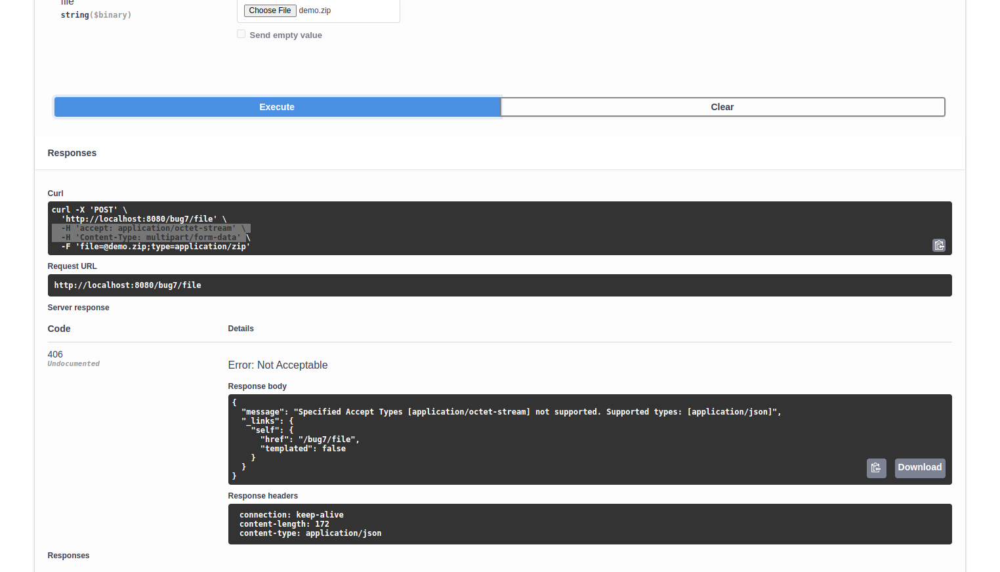

# Micronaut OpenAPI Problems

## Idea

This repository contains a collection of several Micronaut bugs and shortcomings. It started after a discussion on Twitter: https://twitter.com/swaechter_ch/status/1406215247120175107

The example code for several bugs can be found in the `src/main/java` directory of this repository. You can also start the example and access the OpenAPI at http://localhost:8080/swagger-ui/index.html

## Bug 0: ~~I can't use Micronaut with a Java 11 anymore (On Linux and Windows)~~ Fixed

I re-generated the OpenAPI project and receive the following error with Java 11 (Java 1.8 works), so I am not sure if related to Javax/Jakarta change or nullability annotation). With Java 1.8 it works:

```bash
swaechter@debian:~/Nextcloud/Workspace_Java/openapiproblems$ lsb_release -a                        
No LSB modules are available.
Distributor ID: Debian
Description:    Debian GNU/Linux 11 (bullseye)
Release:        11
Codename:       bullseye
swaechter@debian:~/Nextcloud/Workspace_Java/openapiproblems$ java -version
openjdk version "11.0.11" 2021-04-20
OpenJDK Runtime Environment (build 11.0.11+9-post-Debian-1)
OpenJDK 64-Bit Server VM (build 11.0.11+9-post-Debian-1, mixed mode, sharing)
swaechter@debian:~/Nextcloud/Workspace_Java/openapiproblems$ ./gradlew clean build -x test --no-daemon
To honour the JVM settings for this build a single-use Daemon process will be forked. See https://docs.gradle.org/7.0/userguide/gradle_daemon.html#sec:disabling_the_daemon.
Daemon will be stopped at the end of the build 
> Task :compileJava FAILED

FAILURE: Build failed with an exception.

* What went wrong:
Execution failed for task ':compileJava'.
> java.lang.NoClassDefFoundError: javax/annotation/Nonnull

* Try:
Run with --stacktrace option to get the stack trace. Run with --info or --debug option to get more log output. Run with --scan to get full insights.

* Get more help at https://help.gradle.org

BUILD FAILED in 29s
2 actionable tasks: 2 executed
swaechter@debian:~/Nextcloud/Workspace_Java/openapiproblems$
```

Dependencies (Re-generated with launch.micronaut.io for Java 11):

```java
dependencies {
    annotationProcessor("io.micronaut.openapi:micronaut-openapi")
    implementation("io.micronaut:micronaut-http-client")
    implementation("io.micronaut:micronaut-runtime")
    implementation("io.swagger.core.v3:swagger-annotations")
    implementation("javax.annotation:javax.annotation-api")
    runtimeOnly("ch.qos.logback:logback-classic")
    implementation("io.micronaut:micronaut-validation")
}
```
## Bug 1: ~~Some @Schema annotations for object have to be used on fields, others on methods~~ Fixed

Some `@Schema` annotation like for `UUID` have to be used on fields (and only fields), but other can only be used on getter methods (**TODO: Look for example**). When used on a getter method, MN thinks it's an object and not a string of format UUID. This can be seen in the POST example:


In addition/as a reason of `brokenId`, `UUID` shows up as object under `Schemas` which it shouldn't.


Expected result:

* I can use all @Schema annotation on fields or methods (I prefer fields. IMO I think it's more readable. Getter only is ok too, but mixing is bad - we do this at work at the moment and people don't understand the reason).
* `UUID` doesn't show up as type

## Bug 2: ~~@Post endpoint with no parameters generates a wrong object parameter~~ Fixed

A `POST` endpoint without a (request? response? request AND response?) body generates an empty request object. Starting a backup via `POST` (Rest terminology: Create a new backup. The backup configuration is known to the backend):


This issue is already documented here: https://github.com/micronaut-projects/micronaut-openapi/issues/44 and https://github.com/micronaut-projects/micronaut-openapi/issues/402

Expected result:

* I can trigger the endpoint without a request payload

## Bug 3: ~~Enum types cannot be defined as beans~~ Fixed

In earlier MN 2 versions we used enums, e.g. for the frequency of the backup (Weekday or daily). This doesn't work anymore and generates the following error:


Issue is known: https://github.com/micronaut-projects/micronaut-core/issues/5611

**Note**: In the example, the `@Schema` annotation for `BackupFrequencyDto` is commented out, so someone can build and run the application. Re-enable the annotation to reproduce the error

## Bug 4: ~~Enum support is broken~~ Fixed

Before we encountered bug 3, the generation of enum was broken. It didn't return the possible string values, but was an empty object:


Some of this behaviour is documented here: https://github.com/micronaut-projects/micronaut-openapi/issues/483 The inheritance issue (See bug 5) was partially fixed, but is still problematic. The enum problem still exists and/or is blocked by bug 3

Expected result:

* Proper enum values like in MN 2.0/2.1/(2.2?)

## Bug 5: ~~Inheritance via anyOf (and other) doesn't work on getter/fields, but only the class~~ Fixed

Like mentioned in bug 4 or https://github.com/micronaut-projects/micronaut-openapi/issues/483 , a schema with inheritance like anyOf (Object has to be of type X, Y, Z...) still doesn't work if not annotated on the class. This works for me, but is related to issue1: Where to annotate (Now we have 3 locations to annotate: Field, method, class)

Let's say I have more vehicle types (Truck, tank, airplane, scooter) and would like to have endpoints like `/owner/{uuid}/trucksandtanks` with `anyOf={Truck.class, Tank.class}` and `/owner/{uuid}/carsandbikes` with `anyOf={Car.class, Bike.class}`. I am not sure how this should work when one has to specify the extending schemas in the base schema and not the endpoint. Reading the OpenAPI doc https://swagger.io/docs/specification/data-models/oneof-anyof-allof-not/, the anyOf (and other *of* relation are specified in the endpoint and not the schema

On the other hand...can I even define an endpoint like `List<Vehicle> getCarsAndBikes()` with `anyOf={Car.class, Bike.class}`?

Expected result:

* Being able to annotate the anyOf values on the field or getter-method like in bug 1


## Bug 6: ~~Returning StreamedFile does not change the OpenAPI~~ Fixed

See issue https://github.com/micronaut-projects/micronaut-openapi/issues/441

```java
@Get(value = "/file")
@Tag(name = "Bug6")
@ApiResponse(responseCode = "200", description = "Download the same file again")
// Comment in the following line to create proper OpenAPI
//@ApiResponse(responseCode = "200", description = "Download the same file again", content = @Content(mediaType = MediaType.APPLICATION_OCTET_STREAM, schema = @Schema(type = "string", format = "binary")))
@ApiResponse(responseCode = "500", description = "Internal server error")
public SystemFile downloadWaterFile() throws Exception {
    File temporaryFile = File.createTempFile("micronaut", "openapiproblems");
    try (FileOutputStream outputStream = new FileOutputStream(temporaryFile)){
        outputStream.write("Drink more water!".getBytes());
    }
    return new SystemFile(temporaryFile, MediaType.APPLICATION_OCTET_STREAM_TYPE).attach("DrinkMoreWater.txt");
}
```


Expected result:

* I don't have to specify the produces value via @ApiResponse. Micronaut does this when `StreamedFile` or `SystemFile` is returned

## Bug 7: Uploading a file AND returning SystemFile without OpenAPI generates a 403

See bug 6 - but with one change (See https://github.com/micronaut-projects/micronaut-openapi/issues/441#issuecomment-770386287): I upload a file AND return/download the file. Use case: Upload a PDF document to digitally sign it and then return the signed PDF document to the uploader. ~~When the `produce` field is not set, a strange 403 HTTP error is thrown (IMHO even if security is disabled/not included - this was quite misleading and took me some time to understand):~~

When the `produce` field is not set, a 406 HTTP error is thrown. The use of `CompletedFileUpload` and `SystemFile` does not set the proper content type in Micronaut. The cURL request is correct, but Micronaut expects application/json and not application/octet-stream:

```java
// The produces is really important, otherwise we can't trigger the endpoint. It will produce an error
//@Post(value = "/file", consumes = MediaType.MULTIPART_FORM_DATA, produces = MediaType.APPLICATION_OCTET_STREAM)
@Post(value = "/file", consumes = MediaType.MULTIPART_FORM_DATA)
@Tag(name = "Bug7")
@ApiResponse(responseCode = "200", description = "Download the same file again", content = @Content(mediaType = MediaType.APPLICATION_OCTET_STREAM, schema = @Schema(type = "string", format = "binary")))
@ApiResponse(responseCode = "500", description = "Internal server error")
public SystemFile redownloadFile(CompletedFileUpload file) throws Exception {
    File temporaryFile = File.createTempFile("micronaut", "openapiproblems");
    try (FileOutputStream outputStream = new FileOutputStream(temporaryFile)) {
        outputStream.write(file.getBytes());
    }
    return new SystemFile(temporaryFile, MediaType.APPLICATION_OCTET_STREAM_TYPE).attach(file.getFilename());
}
```



Expected result:

* Using CompletedFileUpload leads to the correct content type expected by Micronaut without having to specify it manually via `produces`

## Bug 8: Wrong UUID schema type

Let's say we have a `Greeting` class with a `message` that will be sent from `senderId` to `receiverId`. A schema would look like this:

```java
@Schema(description = "Represent a greeting between a sender and a receiver")
public class Greeting {

    @Schema(description = "Greeting message the receiver will get")
    private String message;

    @Schema(description = "ID of the sender")
    private UUID senderId;

    // Schema is annotated on the getter method bellow
    private UUID receiverId;

    public Greeting() {
    }

    public Greeting(String message, UUID senderId, UUID receiverId) {
        this.message = message;
        this.senderId = senderId;
        this.receiverId = receiverId;
    }

    public String getMessage() {
        return message;
    }

    public void setMessage(String message) {
        this.message = message;
    }

    public UUID getSenderId() {
        return senderId;
    }

    public void setSenderId(UUID senderId) {
        this.senderId = senderId;
    }

    @Schema(description = "ID of the receiver")
    public UUID getReceiverId() {
        return receiverId;
    }

    public void setReceiverId(UUID receiverId) {
        this.receiverId = receiverId;
    }
}
```

The OpenAPI schema should look like this:

```
    Greeting:
      type: object
      properties:
        message:
          type: string
          description: Greeting message the receiver will get
        senderId:
          type: string
          description: ID of the sender
          format: uuid
        receiverId:
          type: string
          description: ID of the receiver
          format: uuid
      description: Represent a greeting between a sender and a receiver
```

Instead we have two problem:

1.) I have to annotate `@Schema` on the getter-method and not on the class attribute. Annotating `@Schema` for `receiverId` on the class attribute will generate this broken schema:

```
    Greeting:
      type: object
      properties:
        message:
          type: string
          description: Greeting message the receiver will get
        senderId:
          type: string
          description: ID of the sender
          format: uuid
        receiverId:
          $ref: '#/components/schemas/UUID'
      description: Represent a greeting between a sender and a receiver
```

So the workaround was to annotate all UUID `@Schema` on the getter-method and not the class attribite (All other attributes where always class-attribute based)

2.) Since Micronaut 3.0.0-RC1 this workaround doesn't work anymore. Switching from 3.0.0-M5 to 3.0.0-RC1 will generate the following broken schema:

```
    Greeting:
      type: object
      properties:
        message:
          type: string
          description: Greeting message the receiver will get
        senderId:
          $ref: '#/components/schemas/UUID'
        receiverId:
          $ref: '#/components/schemas/UUID'
```

And in the Swagger UI:


## Nitpick 9: Custom merged OpenAPI file is not sorted

When defining an additional custom OpenAPI file that is merged into the OpenAPI output, the endpoints/tags are not included into the sorting (Maybe the sorting is done earlier in the process). We describe the `/login` JWT endpoint via tag `Authentication` and the tag lands at the end.

This is not really a problem (more a nitpick), but annoying for OpenAPI users that are used to the alphabetical order of the tags:

Expected result:

* All tags, even manually merged ones, are alphabetically sorted


## Nitpick 10: Make use of inheritance in @Schema

It would be great if we could inherit Schema attributes from abstract classes (For more information see bug 6). I am not sure if there are technical issues with this wish.

## Other bugs

There are a few other bugs I encountered during my bachelor thesis that made the developer experience harder:

### Non OpenAPI related bug: 

Not OpenAPI related, but **a really dangerous API misunderstanding that can lead to data corruption**: https://github.com/micronaut-projects/micronaut-core/issues/2836
